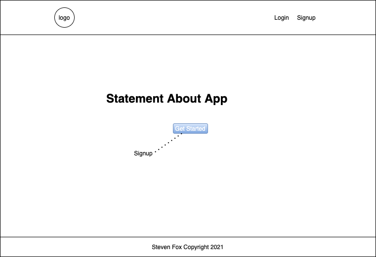
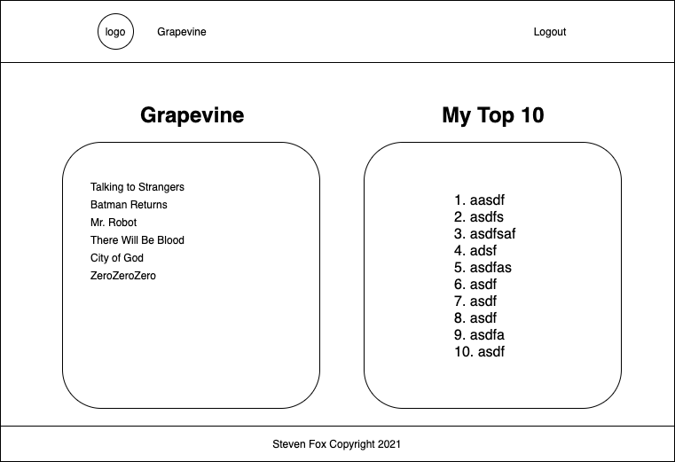
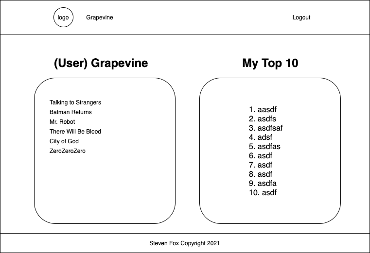
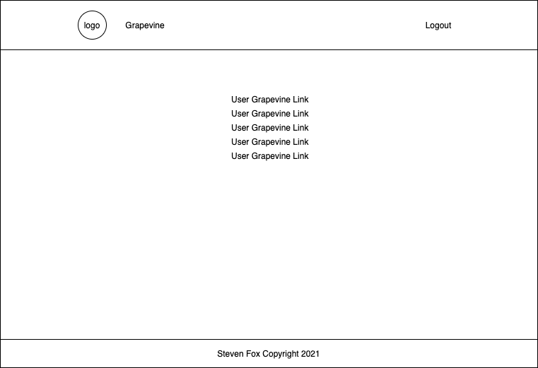
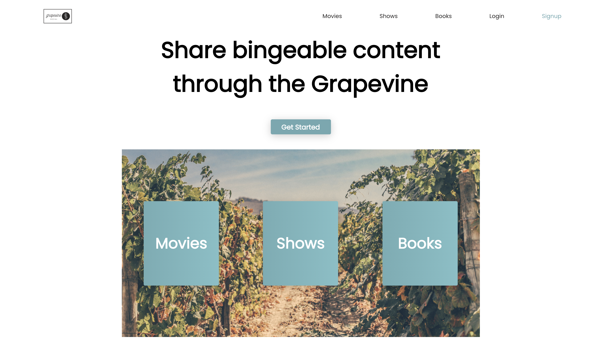
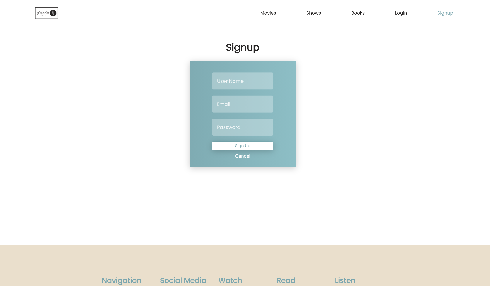
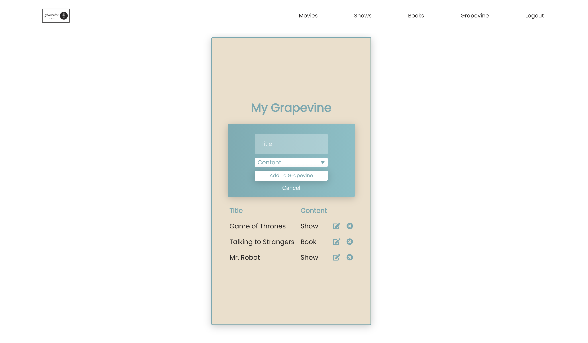
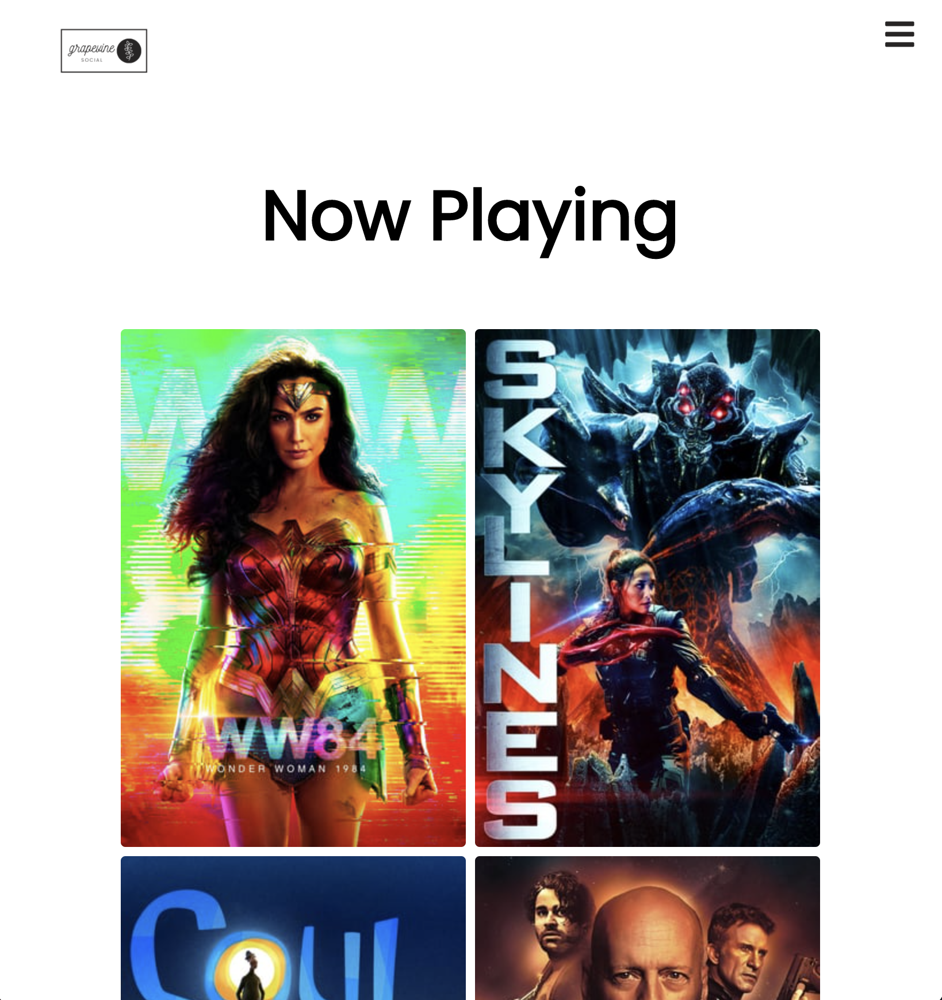
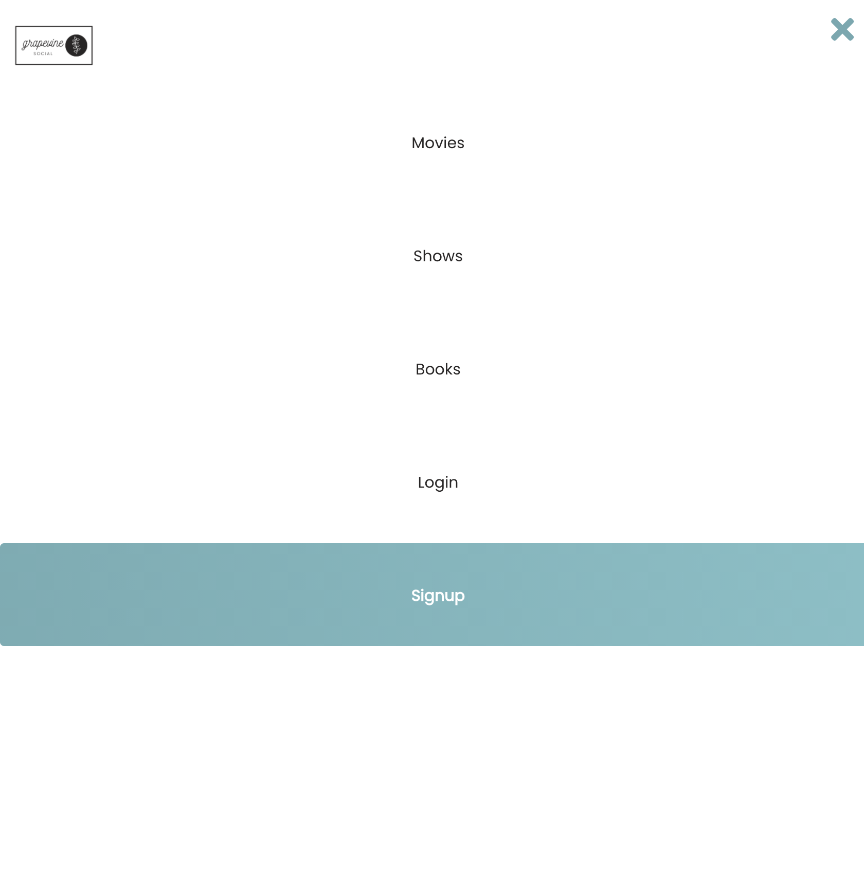

# **Grapevine**
Grapevine was designed to be a community driven application with what content is trending now. So many times we are given recommendations from friends or family on what to watch or read. Grapevine allows the user to keep all those suggestions in one place, and in future states will allow that community to interact with one another.

## Version 1.0
Current build includes:
- Signup
- Login
- User Dashboard
    - Add/Edit/Delete Functionality to Grapevine List
- Movie/Show/Book suggestions by page and current popularity

### Wireframe:

### App Screenshot(s):

### Technologies:
- HTML5
- CSS3
- JavaScript
- Node.js
- Express
- MongoDB
- Mongoose
- Axios
- The Movie DB API
    - Movies/Shows
- New York Times API
    - Books
- JSON Web Token (JWT)
- Heroku
- Netlify
- React JS
- React Router
- Images provided by Unsplash
- Logo created in Canva

## Getting Started
#### Trello:
https://trello.com/b/QgLW9tWM/project-3-board
#### App:
##### Grapevine: 
https://grapevine-app.netlify.app/

### Future Versions to Include
- User to User Functionality
    - Search users
    - Leave recommendations to other users
- Movie/Show/Book query
- Favorite content
    - Send favorite content to dashboard